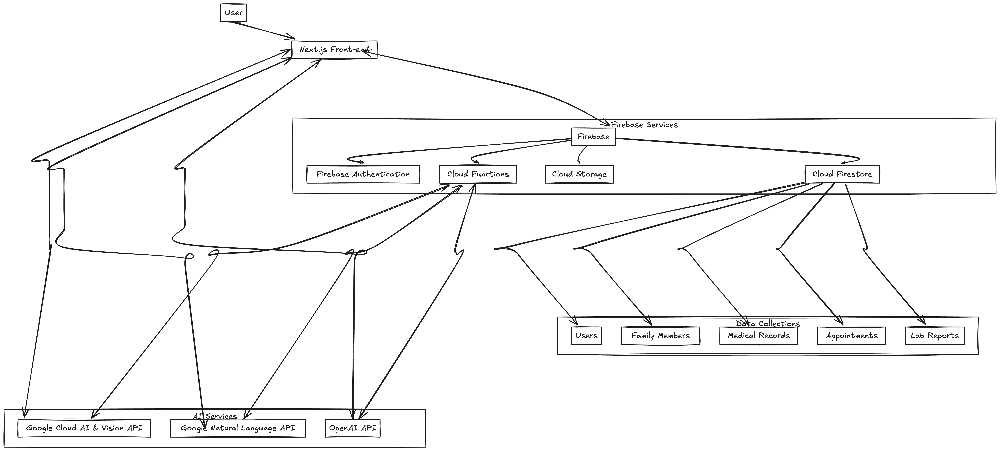

# Zoom My Life - Technical Documentation

## Project Overview

Zoom My Life is a family health management application built with Next.js and Firebase. It allows users to manage health information for family members, including appointments, lab reports, and medications.

## Tech Stack

- **Frontend**: Next.js 15.0.0, React 18.2.0
- **Styling**: Tailwind CSS 3.3.3
- **Authentication**: Firebase Authentication
- **Database**: Firebase Firestore
- **Hosting**: Firebase Hosting
- **State Management**: React Hooks
- **UI Components**: Custom components built with Radix UI primitives

## Project Structure

